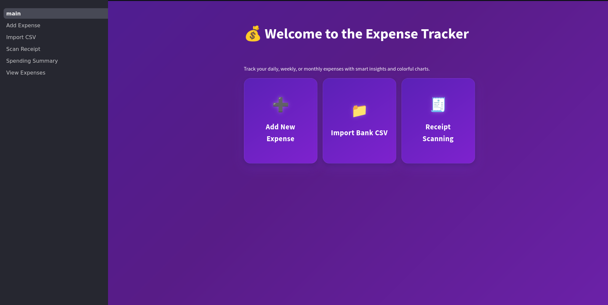
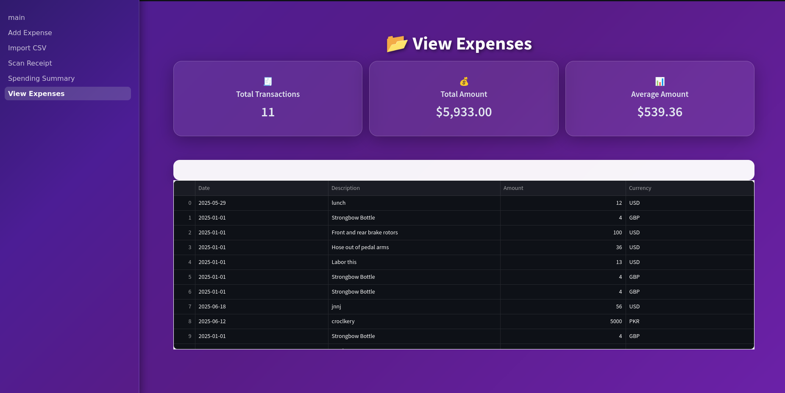

# GoldFish
### Track your finance

A modern, visually stunning expense tracker built with Streamlit. Effortlessly log, import, and visualize your spending with multi-currency support, OCR-powered receipt scanning, and beautiful charts.



## Features

- **Add Expenses:**  
  Quickly log daily expenses with multi-currency support and smart categorization.

- **Import Bank CSV:**  
  Bulk import transactions from your bank statements. Preview and import with a single click.

- **Receipt Scanning (OCR):**  
  Upload a photo of your receipt and let AI extract line items automatically.

- **Spending Summary:**  
  Interactive pie and bar charts to visualize your spending patterns.

- **View Expenses:**  
  Browse, filter, and analyze all your transactions in a clean, stylish table.



## 🛠️ Getting Started

1. **Clone the repo:**
   ```sh
   git clone https://github.com/yourusername/expense-tracker.git
   cd expense-tracker

2. **Install dependencies:**
   ```sh
   pip install -r requirements.txt

3. Set up your google api key
  add your key to a .env file
  ```sh
    GOOGLE_API_KEY="your-google-api-key"
  ```

4. Run the app:
```python
streamlit run main.py

